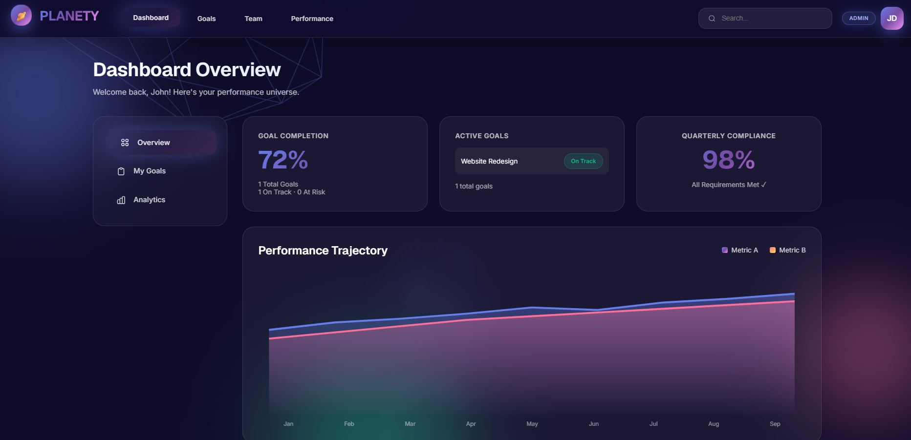
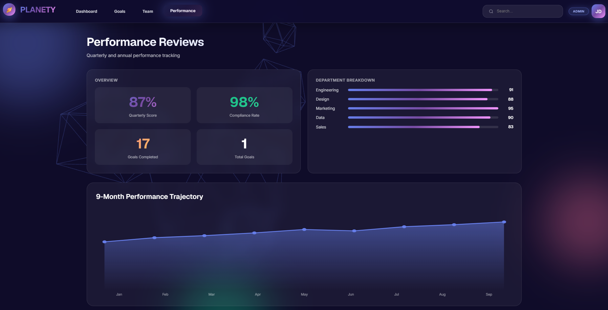

# 🪐 PLANETY
## Smart Goal Setting & Performance Tracking Portal

Enterprise Workflow Management System for Employee Goal Lifecycle, Quarterly Performance Tracking, Analytics, and Organizational Governance.

---

# 🚀 Live Deployment

## 🌐 Frontend (Vercel)
https://planety-wine.vercel.app/

## ⚙️ Backend API (Render)
https://planety-backend.onrender.com/

---

# 📌 Project Overview

PLANETY is a modern enterprise-grade workflow management platform designed to streamline employee goal tracking, quarterly performance reviews, analytics, and governance workflows within organizations.

The platform enables employees, managers, and administrators to collaboratively manage goals, monitor progress, evaluate performance, and improve organizational transparency through a centralized digital ecosystem.

---

# ❗ Problem Statement

Many organizations still rely on spreadsheets, emails, and manual review cycles for employee goal management and quarterly performance tracking. These traditional methods create:

- Poor visibility into employee progress
- Delayed approval workflows
- Lack of accountability
- Inconsistent reporting
- Difficult quarterly tracking
- Inefficient collaboration between teams

PLANETY solves these issues through a centralized enterprise workflow platform.

---

# 🎯 Objectives

- Digitize employee goal lifecycle management
- Automate quarterly performance workflows
- Improve transparency and accountability
- Enable role-based governance
- Provide real-time analytics dashboards
- Reduce manual operational processes

---

# 👥 User Roles

## 👨‍💼 Admin
- Manage users and workflows
- Monitor organization-wide analytics
- Access governance reports
- Track overall performance

## 👨‍💻 Manager
- Review and approve employee goals
- Monitor team progress
- Provide feedback and evaluations

## 👩‍💼 Employee
- Create and manage goals
- Update quarterly achievements
- Track personal performance

---

# ✨ Core Features

- 🔐 JWT Authentication & Role-Based Access
- 🎯 Goal Creation & Goal Tracking
- 📊 Analytics Dashboard
- 📈 Quarterly Performance Reviews
- 👥 Team Management
- 📋 Goal Approval Workflow
- 🔔 Notification & Escalation System
- 🛡️ Audit Logging & Governance
- 🔍 Search & Filtering
- 📱 Responsive Enterprise Dashboard UI

---

# 📸 Application Screenshots

## 🔐 Dashboard Overview



The Dashboard Overview provides employees and administrators with:

- Goal completion tracking
- Active goals overview
- Quarterly compliance monitoring
- Performance trajectory analytics
- Interactive enterprise dashboard UI

---

## 📊 Performance Analytics Dashboard



The Performance Analytics module provides:

- Quarterly performance reviews
- Department-wise analytics
- KPI visualization
- Performance trajectory tracking
- Real-time analytics dashboards

---

# 📊 Workflow

Employee creates goals  
⬇  
Manager reviews and approves goals  
⬇  
Goals become locked  
⬇  
Employee submits quarterly updates  
⬇  
Manager reviews progress  
⬇  
Admin monitors analytics and governance reports

---

# 📏 Validation Rules

- Total goal weightage must equal 100%
- Minimum goal weightage = 10%
- Maximum goals per employee = 8
- Locked goals cannot be edited
- Quarterly updates allowed only during active windows

---

# 🧠 Technology Stack

## Frontend
- HTML5
- CSS3
- JavaScript
- Glassmorphism UI Design
- Responsive Dashboard Layout

## Backend
- Node.js
- Express.js
- JWT Authentication
- REST API Architecture

## Deployment
- Vercel (Frontend Hosting)
- Render (Backend Hosting)
- GitHub (Version Control)

---

# 📡 API Endpoints

## Authentication

| Method | Endpoint | Description |
|--------|----------|-------------|
| POST | `/api/auth/login` | Login user and generate JWT token |
| GET | `/api/auth/me` | Get authenticated user profile |

---

## Goals

| Method | Endpoint | Description |
|--------|----------|-------------|
| GET | `/api/goals` | Fetch all goals |
| POST | `/api/goals` | Create new goal |
| PUT | `/api/goals/:id` | Update goal |
| PATCH | `/api/goals/:id/milestone/:milestoneId` | Update milestone status |
| DELETE | `/api/goals/:id` | Delete goal |

---

## Dashboard & Analytics

| Method | Endpoint | Description |
|--------|----------|-------------|
| GET | `/api/dashboard` | Dashboard analytics |
| GET | `/api/performance` | Performance metrics and charts |

---

## Team Management

| Method | Endpoint | Description |
|--------|----------|-------------|
| GET | `/api/team` | Fetch team members |

---

# 🔐 Security & Governance

PLANETY implements:

- JWT-based Authentication
- Protected API Routes
- Role-Based Access Control
- Audit Logging
- Governance-Oriented Workflow Validation

---

# 🖥️ Project Structure

```bash
planety/
│
├── backend/
│   ├── node_modules/
│   ├── .env
│   ├── package-lock.json
│   ├── package.json
│   └── server.js
│
├── frontend/
│   ├── index.html
│   ├── dashboard.png
│   └── performance.png
│
└── README.md
```

---

# ⚡ Local Setup

## 1️⃣ Clone Repository

```bash
git clone YOUR_GITHUB_REPO_LINK
```

---

## 2️⃣ Start Backend

```bash
cd backend
npm install
npm run dev
```

Backend runs on:

```bash
http://localhost:3001
```

---

## 3️⃣ Start Frontend

Use VS Code Live Server  
OR

```bash
python -m http.server 8080
```

Then open:

```bash
http://localhost:8080
```

---

# 🔑 Demo Credentials

## 👨‍💼 Admin

Email:
```bash
john@planety.com
```

Password:
```bash
password123
```

---

## 👨‍💻 Manager

Email:
```bash
elena@planety.com
```

Password:
```bash
pass456
```

---

## 👩‍💼 Employee

Email:
```bash
aisha@planety.com
```

Password:
```bash
employee123
```

---

# 🚀 Key Innovations

- Enterprise Glassmorphism Dashboard UI
- Role-Based Workflow Architecture
- Real-Time Analytics & Performance Monitoring
- Centralized Goal Lifecycle Management
- Governance-Oriented Enterprise Workflow System

---

# 🔮 Future Scope

- AI-Based Performance Insights
- Predictive Analytics
- Microsoft Teams Integration
- Mobile Application Support
- PostgreSQL Database Integration
- Advanced Reporting Engine
- Real-Time Notifications

---

# 🏆 Conclusion

PLANETY is a scalable and enterprise-ready employee goal management and performance tracking platform that improves organizational visibility, accountability, and workflow efficiency.

The platform combines workflow automation, analytics dashboards, secure authentication, and modern UI/UX principles to deliver a centralized enterprise performance management ecosystem.

---

# 👨‍💻 Developed For Hackathon Submission

PLANETY demonstrates the implementation of a modern enterprise workflow platform using full-stack web technologies, secure APIs, cloud deployment platforms, and modern dashboard architecture.
